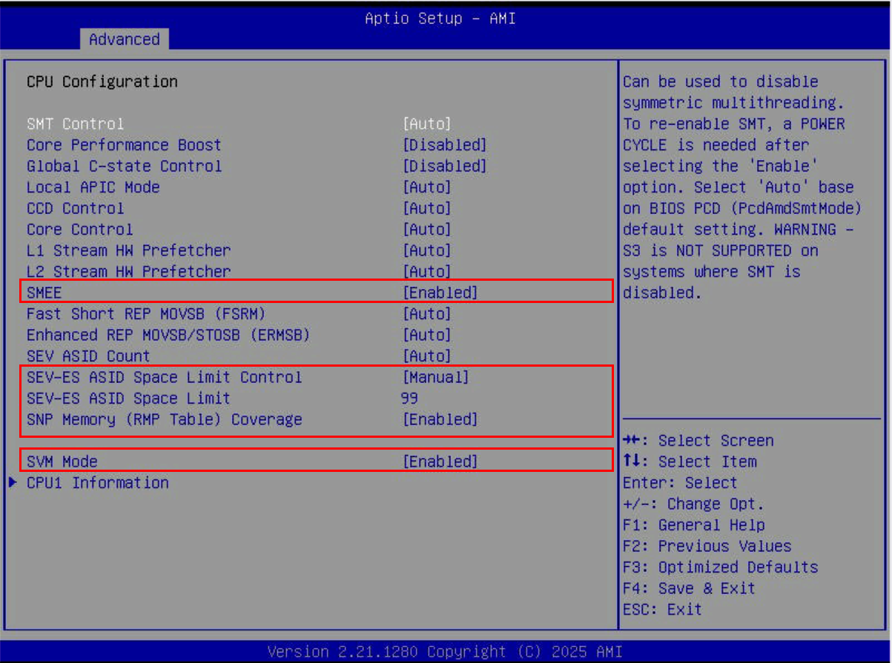
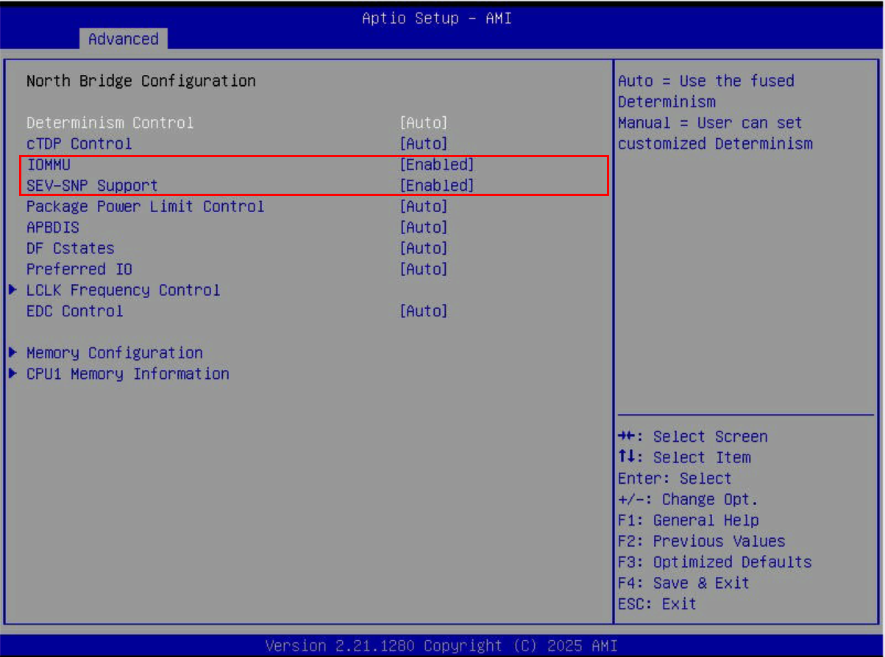

# Confidential MLNode — Full Deployment Runbook

Complete guide to deploy a Confidential MLNode with AMD SEV-SNP, E2E encrypted inference, and hardware attestation.

Implements [Gonka TEE Proposal #951](https://github.com/gonka-ai/gonka/discussions/951).

**Tested on:** 2026-04-03
**Host:** Ubuntu 24.04 LTS, kernel 6.14.0-37-generic
**CPU:** AMD EPYC 7443P 24-Core (Milan, SP3 socket)
**Guest:** Ubuntu 24.04 cloud image, kernel 6.8.0-106-generic

## Table of Contents

- [Prerequisites](#prerequisites)
- [Step 1: Install Host Packages](#step-1-install-host-packages)
- [Step 2: Build QEMU 9.2 with SEV-SNP Support](#step-2-build-qemu-92-with-sev-snp-support)
- [Step 3: Build OVMF (AmdSev Platform)](#step-3-build-ovmf-amdsev-platform)
- [Step 4: Prepare Guest VM Image](#step-4-prepare-guest-vm-image)
- [Step 5: Launch SEV-SNP Guest VM](#step-5-launch-sev-snp-guest-vm)
- [Step 6: Verify SEV-SNP Inside Guest](#step-6-verify-sev-snp-inside-guest)
- [Step 7: Install MLNode Stack](#step-7-install-mlnode-stack)
- [Step 8: Verify TEE Dependencies](#step-8-verify-tee-dependencies)
- [Step 9: Start Confidential MLNode](#step-9-start-confidential-mlnode)
- [Step 10: Test E2E Encrypted Inference](#step-10-test-e2e-encrypted-inference)
- [Verify Host Cannot Read VM Memory](#verify-host-cannot-read-vm-memory)
- [Troubleshooting](#troubleshooting)
- [Architecture](#architecture)
- [Security Properties](#security-properties)

---

## Prerequisites

### Hardware Requirements

- **CPU:** AMD EPYC 7003 (Milan) or newer on SP3/SP5 socket
  - NOT compatible: Ryzen, Threadripper, EPYC 4004 (AM5 socket)
- **RAM:** 64 GB recommended (16 GB allocated to guest)
- **Storage:** 60+ GB free disk space
- **BIOS/UEFI:** Full BMC/IPMI access required for BIOS changes
- **Access:** Root access on the server. All commands below assume you are root (`sudo -i`). Commands inside the guest VM use `sudo` explicitly.

### BIOS Settings (via BMC/IPMI)

Open your server's BMC/IPMI web interface and enter BIOS Setup.

> Screenshots below are from AMI BIOS on a Supermicro board. Your BIOS may look different, but the setting names are the same.

**Advanced → CPU Configuration:**



| Setting | Set to |
|---------|--------|
| SMEE | **Enabled** |
| SEV-ES ASID Space Limit Control | **Manual** |
| SEV-ES ASID Space Limit | **99** |
| SNP Memory (RMP Table) Coverage | **Enabled** |
| SVM Mode | **Enabled** |

**Advanced → North Bridge Configuration:**



| Setting | Set to |
|---------|--------|
| IOMMU | **Enabled** |
| SEV-SNP Support | **Enabled** |

**Save & Exit** to reboot with new settings.

### Verify SEV-SNP on Host

```bash
[ -c /dev/sev ] && echo "SEV device: OK" || echo "SEV device: MISSING"
dmesg | grep -q "SEV-SNP" && echo "SEV-SNP: OK" || echo "SEV-SNP: MISSING"
dmesg | grep -q "RMP table" && echo "RMP table: OK" || echo "RMP table: MISSING"
dmesg | grep -q "SNP enabled" && echo "IOMMU SNP: OK" || echo "IOMMU SNP: MISSING"
```

Expected output:
```
SEV device: OK
SEV-SNP: OK
RMP table: OK
IOMMU SNP: OK
```

If any line says **MISSING**, see [Troubleshooting](#troubleshooting) below.

---

## Step 1: Install Host Packages

```bash
apt update
apt install -y \
  qemu-utils cloud-image-utils cpu-checker sshpass \
  git build-essential ninja-build pkg-config \
  libglib2.0-dev libpixman-1-dev libslirp-dev \
  python3-venv python3-pip flex bison iasl nasm \
  mtools grub-efi-amd64-bin
```

Verify KVM works:
```bash
kvm-ok
# Expected: KVM acceleration can be used
```

---

## Step 2: Build QEMU 9.2 with SEV-SNP Support

Stock QEMU 8.2 from Ubuntu 24.04 only has `sev-guest`. SEV-SNP requires `sev-snp-guest` object, available in QEMU 9.0+.

```bash
cd /root
git clone https://gitlab.com/qemu-project/qemu.git --branch v9.2.3 --depth 1
cd qemu
mkdir build && cd build
../configure --target-list=x86_64-softmmu --enable-kvm --enable-slirp --prefix=/usr/local
make -j$(nproc)
make install
```

Verify:
```bash
/usr/local/bin/qemu-system-x86_64 --version
# QEMU emulator version 9.2.3

/usr/local/bin/qemu-system-x86_64 -object help 2>&1 | grep sev
# sev-guest
# sev-snp-guest    <-- this is what we need
```

---

## Step 3: Build OVMF (AmdSev Platform)

Stock OVMF lacks SEV GUID tables required by QEMU for SNP initialization. `KVM_CAP_READONLY_MEM` is not supported on KVM AMD, so pflash (split CODE/VARS) doesn't work — we need the single-file AmdSev OVMF that uses `-bios`.

```bash
cd /root
git clone https://github.com/tianocore/edk2.git --branch edk2-stable202411 --depth 1
cd edk2
git submodule update --init --depth 1
```

### Patch GRUB Modules

The AmdSev OVMF embeds a GRUB bootloader. Ubuntu's grub package doesn't include `linuxefi` (merged into `linux`) or `sevsecret` modules. Remove them:

```bash
cd /root/edk2/OvmfPkg/AmdSev/Grub
sed -i 's/linuxefi//' grub.sh
sed -i '/sevsecret/d' grub.sh
```

### Replace GRUB Config for Non-Encrypted Boot

The default `grub.cfg` expects LUKS-encrypted disks. Replace it for regular cloud images:

```bash
cat > /root/edk2/OvmfPkg/AmdSev/Grub/grub.cfg << 'EOF'
echo "SEV-SNP Guest Booting..."
set timeout=3

insmod part_gpt
insmod ext2

set root=(hd0,gpt1)
if [ -e (hd0,gpt1)/boot/grub/grub.cfg ]; then
    set prefix=(hd0,gpt1)/boot/grub
    source $prefix/grub.cfg
elif [ -e (hd0,gpt1)/boot/vmlinuz ]; then
    linux (hd0,gpt1)/boot/vmlinuz root=/dev/sda1 console=ttyS0
    initrd (hd0,gpt1)/boot/initrd.img
    boot
else
    echo "Searching for bootable partition..."
    for d in (hd0,gpt1) (hd0,gpt2) (hd0,gpt3) (hd0,gpt14) (hd0,gpt15) (hd0,msdos1); do
        if [ -e $d/boot/grub/grub.cfg ]; then
            set root=$d
            set prefix=($root)/boot/grub
            echo "Found grub config on $d"
            source $prefix/grub.cfg
        fi
    done
    echo "No bootable config found"
fi
EOF
```

### Build

```bash
cd /root/edk2
source edksetup.sh
make -C BaseTools -j$(nproc)

export WORKSPACE=/root/edk2
export EDK_TOOLS_PATH=/root/edk2/BaseTools
export PATH=$PATH:/root/edk2/BaseTools/BinWrappers/PosixLike

build -a X64 -b DEBUG -t GCC5 -p OvmfPkg/AmdSev/AmdSevX64.dsc -n $(nproc)
```

Output: `/root/edk2/Build/AmdSev/DEBUG_GCC5/FV/OVMF.fd` (4 MB)

---

## Step 4: Prepare Guest VM Image

### Download Ubuntu Cloud Image

```bash
mkdir -p /root/snp-vm && cd /root/snp-vm
wget https://cloud-images.ubuntu.com/noble/current/noble-server-cloudimg-amd64.img \
  -O ubuntu-24.04-cloud.img
```

### Create Guest Disk (60 GB overlay)

```bash
qemu-img create -f qcow2 -b ubuntu-24.04-cloud.img -F qcow2 guest.qcow2 60G
```

### Extract Kernel and Initrd

Direct kernel boot is used because the embedded GRUB in AmdSev OVMF can't easily find the cloud image's kernel on partition 16.

```bash
modprobe nbd max_part=8
qemu-nbd -c /dev/nbd0 ubuntu-24.04-cloud.img
sleep 2

mkdir -p /mnt/boot
mount /dev/nbd0p16 /mnt/boot
cp /mnt/boot/vmlinuz-* ./vmlinuz
cp /mnt/boot/initrd.img-* ./initrd.img
umount /mnt/boot
qemu-nbd -d /dev/nbd0
```

### Create Cloud-Init Config

```bash
cat > meta-data << 'EOF'
instance-id: snp-guest-01
local-hostname: snp-guest
EOF

cat > user-data << 'EOF'
#cloud-config
password: snpguest
chpasswd: { expire: False }
ssh_pwauth: True
ssh_authorized_keys:
  - <YOUR_SSH_PUBLIC_KEY_HERE>
packages:
  - python3-pip
  - python3-venv
  - curl
  - wget
  - dos2unix
  - build-essential
  - pkg-config
  - libssl-dev
  - libnuma-dev
  - cmake
runcmd:
  - echo "SNP guest ready" > /tmp/snp-ready
EOF

cloud-localds cloud-init.iso user-data meta-data
```

### Copy OVMF

```bash
cp /root/edk2/Build/AmdSev/DEBUG_GCC5/FV/OVMF.fd ./OVMF_AMDSEV.fd
```

---

## Step 5: Launch SEV-SNP Guest VM

```bash
cd /root/snp-vm

/usr/local/bin/qemu-system-x86_64 \
  -enable-kvm \
  -cpu EPYC-v4 \
  -machine q35,confidential-guest-support=sev0,memory-backend=ram1 \
  -object memory-backend-memfd,id=ram1,size=16G,share=true,prealloc=false \
  -object sev-snp-guest,id=sev0,cbitpos=51,reduced-phys-bits=1,kernel-hashes=on \
  -smp 8 \
  -bios /root/snp-vm/OVMF_AMDSEV.fd \
  -kernel /root/snp-vm/vmlinuz \
  -initrd /root/snp-vm/initrd.img \
  -append "root=/dev/sda1 console=ttyS0 earlyprintk=serial" \
  -drive file=/root/snp-vm/guest.qcow2,format=qcow2,if=none,id=disk0 \
  -device virtio-scsi-pci,id=scsi0,disable-legacy=on,iommu_platform=on \
  -device scsi-hd,drive=disk0 \
  -drive file=/root/snp-vm/cloud-init.iso,format=raw,if=none,id=cloud \
  -device scsi-cd,drive=cloud \
  -netdev user,id=net0,hostfwd=tcp::2222-:22,hostfwd=tcp::8080-:8080 \
  -device virtio-net-pci,netdev=net0,iommu_platform=on \
  -display none \
  -serial file:/root/snp-vm/console.log \
  -monitor unix:/root/snp-vm/monitor.sock,server,nowait \
  -daemonize
```

### QEMU Flags Explained

| Flag | Purpose |
|------|---------|
| `-cpu EPYC-v4` | Expose EPYC CPU features to guest |
| `-machine q35,confidential-guest-support=sev0,memory-backend=ram1` | Q35 machine with SEV-SNP support |
| `-object memory-backend-memfd,...,share=true` | Shared memory backend required for SEV |
| `-object sev-snp-guest,...,kernel-hashes=on` | Enable SEV-SNP with kernel measurement |
| `cbitpos=51,reduced-phys-bits=1` | AMD encryption bit position |
| `-bios OVMF_AMDSEV.fd` | Single-file AmdSev OVMF (no pflash) |
| `-kernel/-initrd/-append` | Direct kernel boot (bypasses GRUB) |
| `iommu_platform=on` | Required for SEV-SNP DMA protection |
| `disable-legacy=on` | Use modern virtio (required for SEV) |
| `hostfwd=tcp::2222-:22` | Forward host port 2222 to guest SSH |
| `hostfwd=tcp::8080-:8080` | Forward host port 8080 to MLNode API |

### Verify Boot

```bash
# Watch console output
tail -f /root/snp-vm/console.log

# Wait ~60s for cloud-init, then SSH in
ssh -p 2222 ubuntu@localhost
# Password: snpguest (or use your SSH key)
```

---

## Step 6: Verify SEV-SNP Inside Guest

### Check Encryption Active

```bash
sudo dmesg | grep -i "Memory Encryption"
# Memory Encryption Features active: AMD SEV SEV-ES SEV-SNP
```

### Load SEV Guest Module

```bash
sudo apt install -y linux-modules-extra-$(uname -r)
sudo modprobe sev-guest
ls -la /dev/sev-guest
# crw------- 1 root root 10, 261 ... /dev/sev-guest
```

### Install snpguest

```bash
curl --proto '=https' --tlsv1.2 -sSf https://sh.rustup.rs | sh -s -- -y
source ~/.cargo/env
cargo install snpguest
```

### Verify Attestation

```bash
mkdir -p /tmp/attestation && cd /tmp/attestation
snpguest report report.bin request_data.txt --random
snpguest display report report.bin

# Fetch and verify AMD cert chain
mkdir -p certs
snpguest fetch vcek -p milan pem ./certs report.bin
snpguest fetch ca pem ./certs milan
snpguest verify certs ./certs
# The AMD ARK was self-signed!
# The AMD ASK was signed by the AMD ARK!
# The VCEK was signed by the AMD ASK!

snpguest verify attestation -p milan ./certs report.bin
# VEK signed the Attestation Report!
```

---

## Step 7: Install MLNode Stack

### Clone gonka repo

```bash
cd /root
# Clone the TEE branch (will be merged to main after review)
git clone https://github.com/kaitakuai/gonka.git --branch tee --depth 1
```

### Create Python venv and install dependencies

> **Important:** Do NOT use `pip install --break-system-packages`. Ubuntu 24.04 has
> debian-managed packages (typing-extensions, jsonschema, packaging) that cannot be
> uninstalled via pip. Always use a venv.

```bash
python3 -m venv /opt/mlnode --system-site-packages
/opt/mlnode/bin/pip install --upgrade pip

# Install MLNode dependencies
/opt/mlnode/bin/pip install \
    fastapi uvicorn httpx huggingface-hub \
    scipy fire toml tenacity \
    pynacl accelerate h2 nvidia-ml-py

# Install CPU PyTorch
/opt/mlnode/bin/pip install torch==2.9.1+cpu torchvision==0.24.1+cpu \
    --index-url https://download.pytorch.org/whl/cpu

# Install vLLM build deps + build from source (pip vLLM doesn't support CPU)
/opt/mlnode/bin/pip install setuptools-scm cmake ninja
cd /tmp
git clone https://github.com/vllm-project/vllm.git vllm-build --branch v0.15.1 --depth 1
cd vllm-build
sed -i 's/torch==2.10.0/torch>=2.9.0/' pyproject.toml
VLLM_TARGET_DEVICE=cpu /opt/mlnode/bin/python3 setup.py build_ext --inplace
/opt/mlnode/bin/pip wheel --no-deps --no-build-isolation -w /tmp/vllm-wheels .
/opt/mlnode/bin/pip install --no-deps /tmp/vllm-wheels/vllm-*.whl

# Verify
/opt/mlnode/bin/python3 -c "from vllm.platforms import current_platform; print(current_platform.device_type)"
# cpu
/opt/mlnode/bin/python3 -c "from nacl.public import PrivateKey; print('PyNaCl OK')"
```

> **Note:** On production nodes with GPU, use `pip install vllm==0.15.1` directly
> (no source build needed) and skip the CPU torch step.

### Set up app directory structure

```bash
# Create /app layout matching the Dockerfile
mkdir -p /app/packages
ln -sf /root/gonka/mlnode/packages/api /app/packages/api
ln -sf /root/gonka/mlnode/packages/pow /app/packages/pow
ln -sf /root/gonka/mlnode/packages/train /app/packages/train
ln -sf /root/gonka/mlnode/packages/common /app/packages/common
```

---

## Step 8: Verify TEE dependencies

```bash
# snpguest should already be installed from Step 6
source ~/.cargo/env
snpguest --version

# Make snpguest available system-wide (MLNode runs as root)
ln -sf $(which snpguest) /usr/local/bin/snpguest

# sev-guest module should already be loaded from Step 6
ls /dev/sev-guest

# Verify all TEE components
/opt/mlnode/bin/python3 -c "from nacl.public import PrivateKey; print('PyNaCl OK')"
/opt/mlnode/bin/python3 -c "import vllm; print(vllm.__version__)"
snpguest --version
```

---

## Step 9: Start Confidential MLNode

```bash
export PYTHONPATH="/app/packages/api/src:/app/packages/pow/src:/app/packages/train/src:/app/packages/common/src"
export VLLM_TARGET_DEVICE=cpu
export VLLM_ENABLE_V1_MULTIPROCESSING=0
export VLLM_ATTENTION_BACKEND=TORCH_SDPA
export TEE_ENABLED=1
export SNPGUEST_PATH=/usr/local/bin/snpguest

# Activate venv
source /opt/mlnode/bin/activate

# Start vLLM backend
nohup python3 -m vllm.entrypoints.openai.api_server \
    --model Qwen/Qwen2.5-0.5B-Instruct \
    --dtype float32 \
    --max-model-len 512 \
    --enforce-eager \
    --host 127.0.0.1 \
    --port 5000 \
    > /tmp/vllm.log 2>&1 &

# Wait for vLLM to load model (~30-60s on CPU)
while ! curl -s http://127.0.0.1:5000/health > /dev/null 2>&1; do sleep 5; done
echo "vLLM ready"

# Start MLNode API with TEE
cd /app/packages/api/src
nohup python3 -m uvicorn api.app:app \
    --host 0.0.0.0 \
    --port 8080 \
    --log-level warning \
    > /tmp/mlnode.log 2>&1 &

sleep 10
curl -s http://127.0.0.1:8080/health
```

On startup, MLNode will:
1. Generate X25519 (encryption) and Ed25519 (signing) keypairs in memory
2. Request SNP attestation report with SHA-512(pubkeys) as report_data
3. Fetch and verify AMD cert chain (ARK → ASK → VCEK)
4. Serve `GET /attestation` and encrypted `POST /v1/chat/completions`

---

## Step 10: Test E2E Encrypted Inference

From the host (or any machine that can reach port 8080):

```bash
pip3 install pynacl httpx
python3 /root/gonka/mlnode/packages/api/client/tee_client.py --url http://127.0.0.1:8080 --prompt "What is TEE?"
```

Expected output:
```
=== 1. Fetch attestation ===
  enc pubkey:    89c6262240250a26...
  sign pubkey:   b7d4f126b3966180...
  certs valid:   True
  report valid:  True
  keys bound:    True

=== 2. Verify key binding ===
  MATCH: True

=== 3. Encrypted inference ===
  HTTP: 200

=== 4. Decrypt response ===
  response: TEE stands for ...

=== 5. Verify metadata signature ===
  signature: VALID
  Response hash bound: VALID
  Tokens: 27 prompt + 35 completion = 62 total

=== Done ===
```

---

## Verify Host Cannot Read VM Memory

Write a secret inside the guest, then try to find it from the host:

**Inside guest** — write a secret to memory and keep the process alive:

```bash
python3 -c "
import ctypes, time
secret = b'SUPER_SECRET_TEE_KEY_12345678'
buf = ctypes.create_string_buffer(secret, len(secret))
print(f'Secret in memory: {secret}')
time.sleep(60)
"
```

**From host** (in a separate terminal, while the guest process is running):

```bash
QEMU_PID=$(pgrep -f "qemu.*guest.qcow2")
ADDR=$(cat /proc/$QEMU_PID/maps | grep "memfd:memory-backend-memfd" | head -1 | cut -d'-' -f1)

# Search for the secret in QEMU process memory
dd if=/proc/$QEMU_PID/mem bs=1M count=16 skip=$((16#$ADDR / 1048576)) 2>/dev/null \
  | grep -c "SUPER_SECRET"
# Expected: 0 — memory is encrypted, secret not found
```

---

## Troubleshooting

### "pflash with kvm requires KVM readonly memory support"

`KVM_CAP_READONLY_MEM` is 0 on KVM AMD. Use the AmdSev OVMF with `-bios` flag instead of split pflash CODE/VARS.

### "SEV information block/Firmware GUID Table block not found"

Stock OVMF doesn't have SEV GUID tables. Must use `OvmfPkg/AmdSev/AmdSevX64.dsc` build.

### "linuxefi.mod not found" during OVMF build

Ubuntu's grub merged `linuxefi` into `linux`. Remove `linuxefi` and `sevsecret` from `grub.sh` GRUB_MODULES.

### Guest boots to GRUB prompt, can't find kernel

Cloud images put the kernel on partition 16 (extended boot). Use direct kernel boot (`-kernel`/`-initrd`) instead of relying on embedded GRUB.

### /dev/sev-guest missing in guest

Install `linux-modules-extra-$(uname -r)` and run `modprobe sev-guest`.

### snpguest requires newer Rust

Ubuntu 24.04 ships Rust 1.75. snpguest 0.10 needs 1.86+. Install via `rustup`.

### vLLM V1 engine fails on CPU

Set `VLLM_ENABLE_V1_MULTIPROCESSING=0` — V1 multiprocessing doesn't work without GPU. Also uninstall `flash-attn` (requires CUDA).

### vLLM "torch==2.10.0+cpu not found"

Patch `pyproject.toml` in vLLM source: `sed -i 's/torch==2.10.0/torch>=2.9.0/'`

---

## Architecture

```
┌──────────────────────────────────────────────────────────────────┐
│ Host (Ubuntu 24.04, EPYC 7443P)                                 │
│                                                                  │
│  QEMU 9.2.3 + KVM                                               │
│  ┌────────────────────────────────────────────────────────────┐  │
│  │ SEV-SNP Encrypted VM (16 GB, 8 vCPU)                      │  │
│  │                                                            │  │
│  │  vLLM 0.15.1+cpu (:5000, localhost only)                   │  │
│  │       ↑                                                    │  │
│  │  MLNode API (:8080, TEE_ENABLED=1)                         │  │
│  │  ├── GET /attestation                                      │  │
│  │  │   → pubkeys + SNP report + AMD certs + VM metadata      │  │
│  │  └── POST /v1/chat/completions (encrypted-only)            │  │
│  │      → decrypt NaCl box → vLLM → encrypt → sign metadata   │  │
│  │                                                            │  │
│  │  TEE Keys (memory only, never on disk):                    │  │
│  │  ├── X25519  → encrypt/decrypt requests and responses      │  │
│  │  └── Ed25519 → sign metadata (token usage)                 │  │
│  │                                                            │  │
│  │  All memory encrypted with per-VM key                      │  │
│  │  Host CANNOT read VM memory                                │  │
│  └────────────────────────────────────────────────────────────┘  │
│                                                                  │
│  AmdSev OVMF (firmware with SEV GUID tables)                     │
│  /dev/sev (host SEV device)                                      │
│  RMP Table (Reverse Map Table for memory protection)             │
└──────────────────────────────────────────────────────────────────┘
         │
         │ Client verifies attestation, then sends encrypted requests
         ▼
┌─────────────────────────────────┐
│ Client                          │
│  1. GET /attestation            │
│  2. Verify AMD chain + keys     │
│  3. Encrypt request (NaCl box)  │
│  4. POST /v1/chat/completions   │
│  5. Decrypt response            │
│  6. Verify metadata signature   │
└─────────────────────────────────┘
```

---

## Security Properties

| Property | How it's enforced |
|----------|-------------------|
| **Memory encryption** | AMD SEV-SNP hardware — per-VM AES key, host reads zeros |
| **E2E encryption** | NaCl box (X25519 + XSalsa20-Poly1305) |
| **Key binding** | SHA-512(pubkeys) embedded in SNP report_data (signed by VCEK) |
| **No plaintext on network** | ProxyMiddleware disabled, only encrypted endpoint active |
| **No keys on disk** | Private keys in Python objects only, tmpfs verified at startup |
| **No sensitive logs** | Prompts/responses never logged, only model name and token counts |
| **Metadata integrity** | Ed25519 signature over metadata + SHA-256(ciphertext) binding |
| **Attestation** | SNP v3 report signed by AMD VCEK, verified via AMD KDS |
| **Tamper evidence** | Measurement in SNP report changes if VM image modified |
