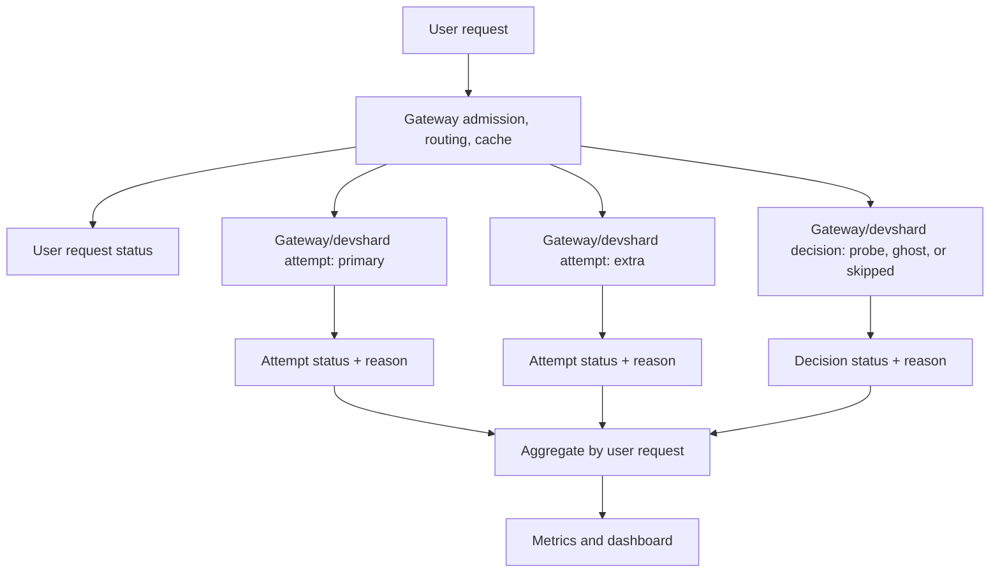

# Proposal: Devshard Gateway Observability

## Summary

`devshardctl` gateway mode is the reliability layer in front of devshards. It
selects escrows, routes user requests, starts extra participant attempts, hides
loser failures, quarantines bad participants, burns ghost/probe slots, serves
cache hits, and triggers timeout handling.

That makes the final user experience better, but it also hides the evidence that
devshard protocol developers need. A user request can succeed while several
participant attempts failed, stalled, were skipped, were shadowed as no-winner,
or forced extra timeout work. Host-side `devshardd` observability is useful, but
it is not a trusted global source in a decentralized network. Hosts may be
dishonest, offline, misconfigured, or unwilling to expose data. Gateway
observability must therefore provide the gateway-owned outside view of what
happened.

The goal of this proposal is a metrics-first Grafana dashboard for protocol
developers. It should show, per participant address, model, and sometimes
escrow:

- what the user saw,
- what the gateway sent, skipped, or ghosted,
- why each gateway-visible failure or policy decision happened,
- how much overscheduling was needed to protect users,
- which participants look unreliable, suspicious, slow, or costly,
- which patterns should inform future protocol changes.

This proposal does not add a lifecycle database, new request drilldown APIs, or
long-term per-request storage. Each user request and gateway/devshard attempt is
a lifecycle concept used to increment precise Prometheus metrics, then the raw
event can disappear.

## Implementation Status

Core V1 is implemented as the first pass:

- Gateway request outcome counters, critical user failure counters, hidden
  failure counters, user-visible winner counters, slot decision counters,
  attempt start/terminal/failure counters, no-winner attempt counters,
  timeout action counters, and participant quarantine state/transition metrics
  are emitted from the gateway's in-memory Prometheus registry.
- Per-model capacity gauges expose current scale, current weight, and baseline
  weight so the dashboard can show reduced capacity by model instead of only an
  aggregate gateway scale.
- The focused dashboard is
  `deploy/join/observability/grafana/dashboards/gonka-gateway-observability.json`.
  It is organized summary-first with top-N tables, minimum-volume filters, and
  lower-level drilldown rows so high-cardinality participant and reason data
  remains readable. The interaction flow is model-first: select a model, inspect
  top reasons, then drill into participants for the selected reason.
- Metrics are recorded at existing lifecycle boundaries in `gateway.go`,
  `redundancy.go`, `session_picker.go` via `runGhostProbe`, and
  `participant_limiter.go`.
- The implementation does not add request persistence, new APIs, database
  writes, or Grafana queries against functional stores.

Deferred from Core V1:

- Diagnostic V1 metric families not needed for the first dashboard.
- Core inference performance metric families listed below. They are design
  targets, not emitted metrics in the current implementation.
- Decode-token histograms and token/s calculations that require actual output
  token plumbing.
- Lifecycle database, request drilldown APIs, OTEL/Jaeger traces,
  Loki-derived panels, and offline protocol-analysis exports.

TODO: review naming across gateway metrics, dashboard labels, and docs for
`slot`, `nonce`, `diff`, `decision`, `attempt`, and `vote`. In particular,
`devshard_gateway_slot_decisions_total` is currently displayed as gateway nonce
consumption in the dashboard because it counts real sends and ghost/no-send
nonce burns, not voting amount. A later cleanup should decide whether to rename
the emitted metric or keep it as a compatibility name with clearer dashboard
labels.

## Goal

Gateway observability must answer protocol-development questions without trusting
host-owned metrics:

1. Which participant addresses perform worse for each model?
2. Why did each participant fail or get skipped: no receipt, empty stream,
   transport error, timeout, quarantine, capability miss, state divergence, or
   another bounded reason?
3. Which user-visible successes hid participant failures?
4. How often does the gateway need extra real sends, ghost burns, probes, or
   skipped slots to keep user failures near zero?
5. How many slots are skipped because of quarantine, and which quarantine mode
   caused the skip?
6. Which participants are no-winner because of shadow quarantine, probation, or
   manual suspicion?
7. Which timeout actions are expected, started, completed, skipped, or failed?
8. Which metrics should protocol developers use to tune participant selection,
   redundancy, timeout windows, quarantine thresholds, validation, and
   incentives?

The first result should be one clear gateway dashboard backed by bounded
Prometheus counters, gauges, and histograms. The dashboard must preserve failure
reasons everywhere it shows failures. A panel that says only "failed" is not
enough.

## Non-Goals

- Do not add a lifecycle DB or any new request/attempt persistence.
- Do not add new admin APIs or drilldown endpoints.
- Do not write new observability data to `gateway.db`, `perf.db`, or devshard
  session storage.
- Do not make dashboards query hot functional stores.
- Do not add OTEL, Jaeger, or tracing requirements in the first pass.
- Do not expose request bodies, prompt hashes, response bodies, private key
  material, raw errors, `request_id`, or `nonce` in Prometheus labels.
- Do not use host-side `devshardd` metrics as the source of truth for gateway
  accountability.
- Do not try to prove semantic truthfulness of model output. The gateway can
  observe transport, timing, stream, protocol, and policy behavior; it cannot
  prove the answer content is honest.

## Current Gateway Role

The important gateway code paths are:

| Area | Files | Current responsibility |
| --- | --- | --- |
| Gateway routing | `devshard/cmd/devshardctl/gateway.go` | Request admission, model access, capacity-aware runtime selection, cache hits, runtime skip reasons. |
| Per-escrow HTTP | `devshard/cmd/devshardctl/proxy.go` | OpenAI-compatible request handling, request accounting/debug surfaces, response mapping. |
| Redundancy | `devshard/cmd/devshardctl/redundancy.go` | Primary and extra attempts, winner selection, loser suppression, empty stream/stall detection, timeout actions. |
| Slot selection | `devshard/cmd/devshardctl/session_picker.go` | Nonce/host selection, ghost/probe/no-send reasons, capability and quarantine skips. |
| Participant health | `devshard/cmd/devshardctl/participant_limiter.go` | Probe quarantine, shadow quarantine, probation, manual no-winner, failure strikes. |
| Performance scoring | `devshard/cmd/devshardctl/hostperf.go`, `devshard/cmd/devshardctl/pairwise.go` | Rolling responsiveness and pairwise latency signals used for speculative routing. |
| Metrics | `devshard/cmd/devshardctl/metrics.go` | Existing Prometheus gateway metrics and the right extension point. |
| Transport | `devshard/transport/client.go` | Upstream HTTP status, transport failures, SSE/receipt path, host connection tracking. |

Existing gateway metrics already cover HTTP route health, limiter rejection,
speculative decision counts, timeout summary counts, picker choices, host timing
by `host_idx`, runtime capacity, and transport connection state. The current gap
is participant-accountable, reason-complete gateway behavior.

The existing devshardd dashboards cover host/protocol internals such as terminal
outcomes, interruptions, ML-node execute/validate attempts, validation
lifecycle, payload serving, mempool/queue depth, traces, and logs. Gateway
observability is the complementary outside view. It must remain useful even when
host-side devshardd data is absent or untrusted.

## Terminology Alignment

Metric names, labels, reasons, and lifecycle terms must align with existing
devshard terminology wherever possible.

Primary sources:

- `devshard/` code, especially `devshard/cmd/devshardctl/`
- `devshard/docs/`
- `devshard/observability/` naming patterns
- `proposals/inference/` as earlier design context, with caution because it is
  partly outdated

Do not invent parallel names when an existing devshard term exists. If gateway
observability needs a new term, the proposal must explain why the existing term
does not fit and how the new term maps back to devshard protocol concepts.

## Request Hierarchy

One user request can produce zero, one, or many gateway/devshard attempts or
scheduling decisions.



User request outcome answers whether the final user was served. Critical user
failures should be close to zero.

Gateway/devshard attempt status answers what happened to each participant
communication or scheduling decision. Attempt failures may be non-zero even when
the user request succeeded.

Overscheduling is the ratio between user requests and gateway/devshard attempts
or decisions. Hidden failure rate is the rate of successful user requests where
one or more gateway/devshard attempts failed, stalled, timed out, were no-winner,
or were skipped for policy/health reasons.

Skipped-slot pressure is tracked separately because it changes protocol behavior
even when no HTTP request is sent.

## Dimensions And Labels

Use these dimensions consistently:

| Dimension | Meaning | Prometheus label? |
| --- | --- | --- |
| `participant_key` | Gonka validator address / participant identity. Primary accountability key. | Yes, bounded by fewer than 100 participant keys in the target deployment. |
| `model` | Requested model id. Required for capability and performance comparison. | Yes. |
| `escrow_id` / `devshard_id` | On-chain devshard escrow/session. Existing gateway metrics usually call this `devshard_id`; this proposal uses `escrow_id` for the same logical id unless referencing existing metrics. Required for localized routing, skipped-slot, and timeout diagnosis. Not part of the default participant-quality view. | Sometimes. Use on counters where per-escrow attribution matters. Avoid it on default performance histograms. |
| `host_idx` | Escrow-local slot index. Useful only with escrow membership mapping. | Existing host-index metrics may keep it; new accountability metrics should prefer `participant_key`. |
| `role` | Why this attempt exists: primary, extra, ghost, skipped, cache alias. | Yes. |
| `visibility` | Whether an attempt was user-visible, suppressed, no-winner, or failed before usable output. | Yes. |
| `outcome` | Terminal result for a specific metric family. Each metric must define its own legal outcome enum. | Yes. |
| `reason` | Bounded explanation from code path/log stage. | Yes. Required on failure and policy counters. |
| `input_token_bucket` | Coarse gateway-side request input estimate. It is not guaranteed to be exact model-tokenizer output. | Yes for performance metrics. |
| `output_token_bucket` | Coarse output-token bucket. Only valid when actual output token count is known. | Yes for decode metrics. |
| `stream` | Whether the request used streaming. | Only where streaming and non-streaming share a metric. |
| `capability_reason` | Bounded subreason for capability no-send. | Only on capability-specific counters. |
| `request_id` | Gateway request id for logs/debug lookup. | No. |
| `nonce` | Devshard inference nonce. | No. |

Forbidden labels: raw error text, request body data, prompt hash, response hash,
private key material, URLs with unbounded ids, `request_id`, `nonce`, trace id.

Reason values must be bounded. If a reason cannot be classified, emit
`reason="unknown"` and make that rare enough to alert on.

### Token Buckets, Visibility, And Hidden Failure Severity

Use coarse token buckets in dashboards. Do not expose exact input tokens, output
tokens, `max_tokens`, or `max_completion_tokens` as labels.

`input_token_bucket` uses the best gateway-side estimate available at the metric
emission point. It must not be treated as canonical model tokenization unless the
implementation has actual tokenizer-backed input tokens.

Input token buckets:

| Bucket | Meaning |
| --- | --- |
| `lt_10k` | Fewer than 10,000 input tokens. |
| `10k_50k` | At least 10,000 and fewer than 50,000 input tokens. |
| `50k_100k` | At least 50,000 and fewer than 100,000 input tokens. |
| `100k_256k` | At least 100,000 and fewer than 256,000 input tokens. |
| `gte_256k` | At least 256,000 input tokens. |

Output token buckets:

| Bucket | Meaning |
| --- | --- |
| `lt_128` | Fewer than 128 output tokens. |
| `128_512` | At least 128 and fewer than 512 output tokens. |
| `512_2k` | At least 512 and fewer than 2,000 output tokens. |
| `2k_8k` | At least 2,000 and fewer than 8,000 output tokens. |
| `gte_8k` | At least 8,000 output tokens. |

Attempt visibility values:

| Visibility | Meaning |
| --- | --- |
| `user_visible_winner` | This attempt produced the content shown to the user. Use for SLO and final-user performance panels. |
| `suppressed_loser` | The attempt produced or could have produced data, but another attempt won. Use for hidden cost and participant-quality analysis. |
| `no_winner_candidate` | The participant was shadow-quarantined, probationary, or manually suspicious and could not win normally. |
| `failed_not_finished` | The attempt failed or did not reach usable output. |

Hidden failure severity values:

| Severity | Meaning |
| --- | --- |
| `loser_pre_winner` | A non-winning attempt failed before the user-visible winner was selected. |
| `loser_after_winner` | A non-winning attempt failed after another attempt already protected the user. |
| `winner_post_content` | The user-visible winner produced content, then stalled or failed. |
| `scheduling_only` | A ghost/no-send, queue, cache, or policy decision created overhead without an upstream participant failure. |

## Reason Taxonomy

The dashboard must show why failures happened. Reason values should map to
existing code paths or log stages, not invented analytical guesses.

### Admission And Routing Reasons

| Reason | Meaning |
| --- | --- |
| `max_concurrent_requests` | Gateway concurrency cap rejected the user request. |
| `max_input_tokens_in_flight` | Gateway input-token cap rejected the user request. |
| `model_access_denied` | Model access mode rejected the caller. |
| `unsupported_model` | No configured runtime supports the requested model. |
| `model_temporarily_unavailable` | Model exists but policy temporarily blocks it. |
| `no_runtime_for_model` | No active compatible runtime exists. |
| `all_escrows_zero_capacity` | Candidate escrows exist but all have zero effective capacity. |
| `high_nonce` | Candidate escrow is near or over its nonce limit. |
| `inactive` | Candidate escrow is inactive. |
| `finalizing` | Candidate escrow is finalizing. |
| `settlement` | Candidate escrow is in settlement. |
| `low_balance` | Escrow balance is low enough to affect routing or replacement. |
| `balance_exhausted` | Escrow balance was exhausted. |
| `escrow_missing` | Escrow lookup or upstream escrow state was missing. |
| `insufficient_balance` | Escrow cannot pay for more work. |
| `invalid_request` | Request parsing, normalization, or parameter validation failed. |
| `body_required` | Request body was missing. |
| `body_too_large` | Request body exceeded the gateway limit. |
| `malformed_json` | Request body was not valid JSON. |
| `unknown_parameter` | Request contained a rejected parameter. |
| `messages_invalid` | Request messages were malformed or unsupported. |
| `parameter_invalid` | Request parameter failed validation. |
| `schema_invalid` | Structured schema validation failed. |
| `structured_outputs_invalid` | Structured output settings were invalid. |
| `operator_disabled` | Gateway disabled mode returned a configured response. |
| `cache_hit` | User request was served from cache. |

### Scheduling And Slot Reasons

Use existing picker and redundancy strings where possible.

| Reason | Meaning |
| --- | --- |
| `normal` | Primary path. |
| `primary_unresponsive` | PerfTracker expects primary to be slow or failed. |
| `receipt_timeout` | No receipt arrived in the expected window. |
| `first_token_timeout` | Receipt arrived but first token lagged. |
| `attempt_failed` | Prior attempt failed before winner selection. |
| `primary_suspicious` | Primary is suspicious or shadow/no-winner. |
| `suspicious_host` | Escalation caused by suspicious/no-winner host. |
| `pairwise_budgeted_speedup` | Pairwise tracker expects another participant to be faster. |
| `pairwise_ab_sample` | Intentional pairwise exploration sample. |
| `pairwise_insufficient_data` | Pairwise mode lacks enough data and falls back. |
| `secondary_faster` | Legacy/simple speed policy expects secondary advantage. |
| `poc_probe` | PoC/probe path caused extra scheduling. |
| `poc_unavailable_host` | Picker burned a ghost because PoC made the host unavailable. |
| `participant_throttled_no_send` | Picker burned a ghost because the participant is probe-quarantined/throttled. |
| `participant_capability_no_send` | Participant cannot serve the request shape/model. |
| `no_compatible_request_after_stale` | Queued requests excluded this participant past the stale threshold. |
| `all_hosts_excluded` | Request already tried every distinct participant in the escrow. |
| `no_available_host` | Untried participants exist but none are currently usable. |
| `stale_wait` | Picker held a queued request while waiting for a compatible slot. |
| `context_cancelled` | Picker or request context was cancelled before dispatch. |
| `picker_stopped` | Picker stopped before it could dispatch. |

### Attempt Failure Reasons

| Reason | Meaning |
| --- | --- |
| `no_receipt` | No receipt was observed. |
| `receipt_but_no_content` | Receipt arrived but no content appeared. |
| `empty_stream` | Stream produced no usable content chunks. |
| `error_stream` | Host returned an OpenAI-style streamed error. |
| `content_but_not_finished` | Content appeared but finish was missing. |
| `winner_stalled_after_content` | Winner emitted content then stalled. |
| `inter_chunk_stall` | Stream stalled between chunks. |
| `hard_timeout` | Attempt exceeded the hard timeout. |
| `transport_error` | Connection, DNS, TLS, timeout, or non-HTTP transport failure. |
| `eof_transport` | EOF-style stream/read failure. |
| `sse_truncated` | SSE stream ended unexpectedly. |
| `http_429` | Host returned HTTP 429. |
| `http_503` | Host returned HTTP 503. |
| `http_forbidden` | Host returned HTTP 403. |
| `http_not_found` | Host returned HTTP 404. |
| `http_timestamp_drift` | Host returned timestamp-related HTTP 401. |
| `http_error` | Other non-success HTTP status. |
| `phase_transition_aborted` | Phase changed and attempt was intentionally aborted. |
| `state_divergence` | Local/session state diverged from expected state. |
| `client_cancelled` | Client disconnected or cancelled. |

### Policy And Participant-Health Reasons

| Reason | Meaning |
| --- | --- |
| `probe_quarantine` | Participant is blocked from real traffic for the model. |
| `shadow_quarantine` | Participant receives traffic but cannot win. |
| `probation` | Participant is recovering but remains no-winner. |
| `manual_suspicious` | Participant is on the manual suspicious list. |
| `empty_stream_quarantine` | Empty-stream strike threshold caused shadow quarantine. |
| `eof_transport_quarantine` | EOF strike threshold caused probe quarantine. |
| `transport_failure_quarantine` | Non-EOF transport failure caused probe quarantine. |
| `http_throttle_quarantine` | HTTP 429/503 caused probe quarantine. |
| `stalled_winner_quarantine` | Stalled winner caused shadow quarantine. |

### Timeout Taxonomy

Timeout metrics use three separate label dimensions: `kind`, `action`, and
`reason`. Do not duplicate `kind` or `action` values inside `reason`.

Timeout kind values:

| Kind | Meaning |
| --- | --- |
| `refused` | No receipt before refusal timeout. |
| `execution` | Receipt exists but execution did not finish before execution timeout. |
| `unknown` | Classified fallback. |

Timeout action values:

| Action | Meaning |
| --- | --- |
| `expected` | Attempt should need timeout handling. |
| `started` | Timeout handling began. |
| `completed` | Timeout handling completed. |
| `skipped` | Timeout handling was intentionally skipped. |
| `failed` | Timeout handling failed. |

Timeout reason values:

| Reason | Meaning |
| --- | --- |
| `none` | No additional reason applies. |
| `nonce_already_finished` | Timeout skipped because nonce was already finished. |
| `empty_stream_without_non_empty_winner` | Timeout skipped for empty stream without a non-empty winner. |
| `long_response_after_content` | Timeout skipped/deferred because long content had already appeared. |
| `timeout_insufficient_votes` | Timeout vote collection lacked enough accepted weight. |
| `timeout_collection_error` | Timeout vote collection failed. |
| `timeout_diff_send_failed` | Timeout diff could not be sent. |
| `timeout_vote_rejected` | A contacted verifier rejected the timeout. |
| `timeout_vote_error` | A contacted verifier errored while verifying timeout. |
| `timeout_vote_queue_expired` | Verifier queue wait expired before the vote RPC. |

Per-verifier timeout vote metrics are future work unless `user.Session` exposes
structured verifier outcomes. Executor-level timeout actions are in scope.

## Metric Taxonomy

Metrics should be incremented at existing gateway lifecycle boundaries. Do not
add a request ledger to derive them later.

### Authoritative Metrics

Use one authoritative metric for each dashboard question. Other metrics may add
diagnostic detail, but they should not be mixed into the same ratio without an
explicit reason.

| Question | Authoritative metric |
| --- | --- |
| What happened to the user request? | `devshard_gateway_requests_total` |
| Whose output did users see? | `devshard_gateway_user_visible_wins_total` |
| Which user successes hid gateway-visible problems? | `devshard_gateway_user_requests_with_hidden_failure_total` |
| Which slots were real sends, ghost/no-send burns, or exhausted? | `devshard_gateway_slot_decisions_total` |
| Which real attempts started? | `devshard_gateway_attempts_started_total` |
| How did real attempts terminate? | `devshard_gateway_attempts_terminal_total` and `devshard_gateway_attempt_failures_total` |
| What is the current participant quarantine/no-winner state? | `devshard_gateway_participant_quarantine_state` |
| What timeout work happened for a participant? | `devshard_gateway_timeout_actions_total` |
| How fast was user-visible and attempt-level inference? | `devshard_gateway_user_visible_ttft_seconds`, `devshard_gateway_attempt_first_content_seconds`, and decode token/duration metrics |

### Core V1 Metrics

Core metrics drive the first dashboard and default participant-quality table.
They avoid `escrow_id` unless the metric is specifically about slots.

```text
devshard_gateway_requests_total{model,outcome,reason}
devshard_gateway_critical_user_failures_total{model,reason}
devshard_gateway_user_requests_with_hidden_failure_total{model,severity,reason}
devshard_gateway_user_visible_wins_total{participant_key,model}

devshard_gateway_slot_decisions_total{
  participant_key,
  model,
  escrow_id,
  decision,
  reason,
  quarantine_mode
}

devshard_gateway_attempts_started_total{
  participant_key,
  model,
  role,
  reason,
  quarantine_mode
}

devshard_gateway_attempts_terminal_total{
  participant_key,
  model,
  role,
  outcome,
  visibility
}

devshard_gateway_attempt_failures_total{
  participant_key,
  model,
  role,
  reason,
  visibility
}

devshard_gateway_participant_quarantine_state{participant_key,model,mode}
devshard_gateway_participant_quarantine_transitions_total{participant_key,model,mode,reason}
devshard_gateway_no_winner_attempts_total{participant_key,model,reason,quarantine_mode}

devshard_gateway_timeout_actions_total{
  participant_key,
  model,
  kind,
  action,
  reason
}
```

User request `outcome` values:

| Outcome | Meaning |
| --- | --- |
| `success` | User received a successful response or stream. |
| `failed` | Gateway returned an error after trying or deciding no usable path exists. |
| `cached` | Gateway served cached output without new participant traffic. |
| `client_cancelled` | Client disconnected or cancelled. |
| `model_rejected` | Model policy/access rejected the request. |
| `gateway_limited` | Gateway-wide limit rejected the request. |
| `runtime_unavailable` | No compatible runtime/escrow was available. |
| `invalid_request` | Request failed parsing or validation. |
| `gateway_disabled` | Gateway disabled mode returned a configured response. |
| `unknown` | Classified fallback; should be rare. |

Real attempt `role` values:

| Role | Meaning |
| --- | --- |
| `primary` | First real attempt intended to serve the user request. |
| `extra` | Additional real attempt caused by redundancy/fallback. |

Ghost/no-send, skipped, and cache-alias decisions are counted by
`slot_decisions_total`, `picker_queue_events_total`, or request/cache metrics,
not by real attempt metrics. Do not use `role="probe"` for current gateway
behavior; current probe-like paths are ghost/no-send burns unless a future
implementation introduces a real HTTP probe.

Real attempt `outcome` values:

| Outcome | Meaning |
| --- | --- |
| `success` | Attempt completed and is usable. |
| `failed` | Attempt ended with a communication, stream, protocol, or application failure. |
| `not_finished` | Attempt started but did not reach expected finish state. |
| `client_cancelled` | Client cancellation affected the attempt. |
| `timeout_skipped` | Timeout was expected but intentionally skipped. |
| `unknown` | Classified fallback; should be rare. |

`attempt_failures_total` carries `reason`; `attempts_terminal_total` does not.
This keeps high-cardinality failure reasons out of the main terminal counter.

`visibility` is the single winner/loser/no-winner encoding for attempt metrics.
Do not add parallel `winner`, `hidden_from_user`, or `no_winner` boolean labels.
`attempts_started_total` does not include `visibility` because winner/loser state
is only known later, after race settlement.

`user_requests_with_hidden_failure_total` is emitted at user-request settlement,
after the gateway knows the final user request outcome and whether another
attempt protected the client.

`critical_user_failures_total` is the small user-visible failure set that should
stay near zero. It should include failed, runtime unavailable, gateway limited,
invalid request, and model rejected when those are not intentional maintenance.

`user_visible_wins_total` counts the participant whose output was actually shown
to the user. It has no `escrow_id` label by default because the main question is
which address users really see for each model. Cached requests should not
increment this metric unless the gateway can safely attribute the cache source to
the original winner.

Route latency should use the existing gateway HTTP duration metric unless a
model-aware duration is added later.

### Core Inference Performance Metrics

Status: not implemented in Core V1. These metric names are future
instrumentation targets and should not be referenced by the current dashboard
until `devshardctl` emits them.

```text
devshard_gateway_attempt_receipt_seconds{participant_key,model,outcome}
devshard_gateway_attempt_total_seconds{participant_key,model,outcome}

devshard_gateway_user_visible_ttft_seconds{
  participant_key,
  model,
  input_token_bucket,
  outcome
}

devshard_gateway_attempt_first_content_seconds{
  participant_key,
  model,
  input_token_bucket,
  visibility,
  outcome
}

devshard_gateway_attempt_prefill_after_receipt_seconds{
  participant_key,
  model,
  input_token_bucket,
  visibility,
  outcome
}

devshard_gateway_attempt_decode_duration_seconds{
  participant_key,
  model,
  input_token_bucket,
  output_token_bucket,
  visibility,
  outcome
}

devshard_gateway_attempt_decode_tokens_total{
  participant_key,
  model,
  input_token_bucket,
  output_token_bucket,
  visibility,
  outcome
}
```

These metrics attribute inference performance to participant identity, not only
escrow-local `host_idx`. Keep the default participant-quality performance view
aggregated by `participant_key` and `model`. Escrow-specific performance belongs
in diagnostics only.

Definitions:

| Metric | Meaning |
| --- | --- |
| `attempt_receipt_seconds` | Time from upstream send to devshard receipt. |
| `attempt_total_seconds` | Time from upstream send to attempt completion. Do not include loser settlement after the attempt is done. |
| `user_visible_ttft_seconds` | Time from gateway request acceptance to the first content-bearing chunk successfully written to the client for the user-visible winner. Cache hits and non-streaming requests do not increment it. |
| `attempt_first_content_seconds` | Time from upstream attempt send to the first content-bearing chunk for that attempt. |
| `attempt_prefill_after_receipt_seconds` | Time from receipt observed by the gateway to the first content-bearing chunk. |
| `attempt_decode_duration_seconds` | Time from first content-bearing chunk to generation end for that attempt. Do not include timeout handling, loser settlement, or background drain. |
| `attempt_decode_tokens_total` | Actual output tokens for the attempt, from `MsgFinishInference.OutputTokens` or final OpenAI usage when available. |

Decode tokens/s is derived from `attempt_decode_tokens_total` and
`attempt_decode_duration_seconds`. Do not add a separate
`attempt_decode_tokens_per_second` metric in the first pass. Do not derive decode
tokens/s from SSE chunk count. Chunks and bytes can be useful future diagnostics,
but they are not tokens. If actual output tokens are unavailable, do not
increment decode token metrics.

For thinking/reasoning models, content-bearing chunks include visible assistant
content, reasoning content, and tool-call content if those chunks are forwarded
to the user. If a future dashboard needs "first visible answer token" separate
from "first reasoning/tool token", add a new bounded `content_source` label or a
separate metric.

### Derived Ratios

Do not add a separate required `devshard_gateway_overscheduled_attempts_total`
counter. Overscheduling overlaps with request, slot, and attempt metrics and
should be derived from authoritative counters.

```text
extra_real_sends_per_user_request =
  rate(devshard_gateway_attempts_started_total{role="extra"}[$window])
  / rate(devshard_gateway_requests_total[$window])

ghost_no_send_per_user_request =
  rate(devshard_gateway_slot_decisions_total{decision="ghost_no_send"}[$window])
  / rate(devshard_gateway_requests_total[$window])

suppressed_losers_per_user_request =
  rate(devshard_gateway_attempts_terminal_total{visibility="suppressed_loser"}[$window])
  / rate(devshard_gateway_requests_total[$window])

failed_sent_attempts_per_successful_user_request =
  rate(devshard_gateway_attempts_terminal_total{
    outcome=~"failed|not_finished",
    visibility="failed_not_finished"
  }[$window])
  / rate(devshard_gateway_requests_total{outcome="success"}[$window])
```

### Diagnostic V1 Metrics

Diagnostic metrics explain localized or lower-level gateway behavior. They can
appear in gateway mechanics, heatmaps, or drilldown panels, but should not drive
the default participant-quality score unless explicitly stated.

Status: not implemented in Core V1. Treat metric names in this section as future
metric contracts. Dashboards should not reference them until implementation and
dashboard lint confirm they are emitted.

#### Runtime Selection

```text
devshard_gateway_runtime_selection_total{model,escrow_id,outcome,reason}
```

Runtime selection `outcome` values: `selected`, `skipped`, `unavailable`.

#### Cache Lifecycle

```text
devshard_gateway_cache_events_total{model,stream,event,reason}
```

`event` values: `hit`, `miss`, `stored`, `store_skipped`, `expired`.

`reason` should stay bounded: `cache_hit`, `cache_miss`,
`noncacheable_status`, `noncacheable_error`, `write_error`, `request_error`,
`expired`, `unknown`.

#### Limiter And PoC Bypass

```text
devshard_gateway_limiter_bypass_total{model,reason}
```

`reason` values: `poc`, `confirmation_poc`, `unknown`.

#### Picker Queue Events

```text
devshard_gateway_picker_queue_events_total{model,escrow_id,event,reason}
```

`event` values: `hold`, `drop`, `chooser_error`, `stopped`.

`held` is not a slot decision because it does not consume a nonce. Use this
metric for queue holds and drops, and `slot_decisions_total` for real sends or
ghost/no-send nonce burns.

#### Capability Subreasons

```text
devshard_gateway_capability_no_send_total{
  participant_key,
  model,
  escrow_id,
  capability_reason
}
```

`capability_reason` values: `tool_choice_unsupported`,
`context_limit_exceeded`, `escrow_state_root_diverged`, `unknown`.

#### Escalation Starts And Skips

```text
devshard_gateway_escalations_total{
  participant_key,
  model,
  stage,
  action,
  trigger_reason,
  skip_reason
}
```

`action` values: `started`, `skipped`.

`skip_reason` values: `attempt_limit`, `race_decided`, `exhausted`,
`client_cancelled`, `unknown`. Use `skip_reason="none"` when action is
`started`.

#### No-Winner Fallback Wins

```text
devshard_gateway_no_winner_fallback_wins_total{
  participant_key,
  model,
  reason,
  quarantine_mode
}
```

This counts cases where a suspicious, shadow-quarantined, or probationary
participant eventually becomes the fallback winner because no clean winner is
available.

#### Participant Strike And Manual Suspicion State

```text
devshard_gateway_participant_failure_strikes{participant_key,model,mode}
devshard_gateway_manual_suspicion_state{participant_key}
devshard_gateway_manual_suspicion_transitions_total{participant_key,action}
```

`action` values for manual suspicion: `added`, `removed`.

#### Upstream Transport Attribution

```text
devshard_gateway_upstream_requests_total{
  participant_key,
  model,
  path_kind,
  outcome,
  status_code,
  error_class,
  quarantine_action
}
```

`path_kind` should reuse existing transport path kinds: `inference`,
`verify_timeout`, `challenge_receipt`, `gossip`, `query`, `other`.

`outcome` values: `success`, `http_error`, `transport_error`,
`admission_rejected`, `cancelled`, `unknown`.

`error_class` values should be bounded: `none`, `eof`, `sse_truncated`,
`dial_timeout`, `connection_refused`, `connection_reset`, `dns`, `tls`,
`context_cancelled`, `other`.

`quarantine_action` values: `none`, `probe_quarantine`, `shadow_quarantine`,
`strike_incremented`, `ignored_non_inference`.

#### Stream Delivery Outcomes

```text
devshard_gateway_stream_delivery_total{model,outcome,reason}
```

`outcome` values: `ok`, `client_cancelled`, `write_failed`, `flush_failed`,
`done_write_failed`, `host_error`, `error_after_done`, `unknown`.

This tracks gateway-to-client delivery, not host execution. Client delivery
failures matter because the gateway can continue background drain or protocol
settlement after the user is gone. They should not be confused with participant
execution quality.

## Dashboard

Add a gateway dashboard focused on protocol developers. The dashboard should have
filters for `model`, `participant_key`, `escrow_id`, `reason`, and time window.

Core rows should use the authoritative metrics listed above. Diagnostic rows can
use more specialized metrics, but they should not change the default
participant-quality score without an explicit dashboard note.

### Row 1: User Health

Purpose: show whether users are protected.

Panels:

- User requests by `outcome` and `reason`.
- Critical user failures by `reason`.
- User success rate.
- Gateway p95 route latency.
- Active requests and input tokens in flight from existing gateway metrics.
- Limiter rejects by reason.
- Runtime unavailable / model rejected / invalid request rates.
- Cache hit rate.

### Row 2: Devshard Attempt Health

Purpose: show what happened behind each user request.

Panels:

- Attempts started by `role`.
- Attempts terminal by `outcome`.
- Attempt failures by `reason`.
- Winner vs loser outcomes.
- User-visible wins by participant and model.
- Sent attempts per user request.
- Failed sent attempts per successful user request.

### Row 3: Inference Performance

Purpose: compare user-visible latency and participant execution quality.

Panels:

- User-visible TTFT p50/p95/p99 by model and input token bucket.
- User-visible TTFT p95 by participant and model.
- Attempt first-content p95 by `visibility`, model, and input token bucket.
- Prefill-after-receipt p95 by participant and input token bucket.
- Decode tokens/s p50/p95 by participant, model, and input token bucket.
- Decode tokens/s comparison for `user_visible_winner` vs `suppressed_loser`.
- Slow-but-successful participants: high TTFT or decode latency with low failure
  rate.
- Fast-but-unreliable participants: low TTFT but high hidden failure, no-winner,
  or timeout rate.

### Row 4: Hidden Failures

Purpose: show failures hidden by redundancy.

Panels:

- User requests with hidden failures by severity and reason.
- Hidden loser failures before winner selection.
- Hidden loser failures after winner selection.
- Winner failures after content.
- Top hidden failure participants by model.
- Top hidden failure reasons by model.

### Row 5: Overscheduling

Purpose: show cost of protecting the user.

Panels:

- Extra real sends per user request.
- Ghost/no-send slots per user request.
- Suppressed losers per user request.
- Overscheduling derived from authoritative request, slot, and attempt metrics.
- Useful redundancy vs waste:
  - useful: `receipt_timeout`, `first_token_timeout`,
    `primary_unresponsive`, `attempt_failed`, `pairwise_budgeted_speedup`;
  - exploration: `pairwise_ab_sample`, `poc_probe`;
  - waste/policy pressure: `participant_throttled_no_send`,
    `participant_capability_no_send`, `no_compatible_request_after_stale`,
    `all_hosts_excluded`, `no_available_host`, `manual_suspicious`,
    `shadow_quarantine`, `probation`.

### Row 6: Skipped Slots And Quarantine Pressure

Purpose: show how much protocol scheduling is changed before any HTTP send.

Panels:

- Slots skipped because of quarantine by participant, model, and escrow.
- Ghost burns by reason.
- Capability no-send by model and participant.
- PoC unavailable host ghost burns.
- No available host / all hosts excluded rates.
- Current quarantine state by participant and model.
- Quarantine transitions by reason.

### Row 7: Participant Quality

Purpose: make bad or suspicious addresses obvious.

Default table dimensions: `participant_key`, `model`.

Do not include `escrow_id` in the default participant quality table. Escrow views
belong in the heatmaps and localized diagnostics, where the question is whether a
specific escrow has routing, slot, or timeout problems.

Columns:

| Column | Meaning |
| --- | --- |
| sent attempts | Real communications sent upstream. |
| success rate | `success / sent attempts`. |
| hidden failure rate | Hidden failures on successful user requests. |
| no receipt rate | `reason=no_receipt`. |
| empty stream rate | `reason=empty_stream`. |
| transport error rate | Transport and EOF reasons. |
| timeout action rate | Timeout expected/started/completed/skipped/failed. |
| p95 receipt | Receipt latency. |
| p95 user-visible TTFT | Time until users see first content from this participant. |
| p95 first content | Attempt first-content latency. |
| p95 prefill after receipt | Time from receipt to first content. |
| p95 total | Total attempt latency. |
| decode tokens/s | Actual output tokens divided by decode duration, only when output tokens are known. |
| user-visible wins | Participant outputs shown to final users. |
| attempt wins | Winner attempts before cache/user-visible aggregation. |
| no-winner attempts | Shadow/probation/manual suspicious sends that could not win. |
| skipped quarantine slots | No-send slots caused by quarantine. |
| quarantine mode | Current probe/shadow/probation/none state. |

Tables should apply a minimum volume threshold, for example at least 20 sent
attempts in the selected window, so low-sample noise does not dominate.

### Row 8: Model And Escrow Heatmaps

Purpose: find localized failures.

Panels:

- Participant x model failure heatmap by reason.
- Participant x escrow failure heatmap by reason.
- Model x escrow overscheduling heatmap.
- Runtime selection skips by model and escrow.
- Capability skips by model and participant.

All escrow-specific heatmaps are diagnostic. They should explain localized
routing, slot, or timeout problems, not replace the default participant+model
quality view.

### Row 9: Timeout Actions

Purpose: understand timeout pressure and skipped/failed timeout handling.

Panels:

- Timeout expected vs started vs completed vs skipped vs failed.
- Timeout kind breakdown: `refused`, `execution`, `unknown`.
- Timeout skip reasons.
- Timeout failures by participant and model.
- Attempts with `not_finished` but no timeout action.
- Executor-level insufficient vote or collection error rates, only if those
  outcomes are structurally available.

### Row 10: Diagnostic Gateway Mechanics

Purpose: expose gateway behavior that changes request flow before or after
participant execution.

Panels:

- Cache lifecycle events: hit, miss, stored, skipped, expired.
- Picker queue holds, drops, chooser errors, and stopped events.
- Stream delivery failures to the client by reason.
- Participant strike distribution by model and mode.
- Manual suspicion state and transitions.
- Escalation started vs skipped by trigger and skip reason.
- No-winner fallback wins by participant and model.
- Upstream transport outcomes by path kind, status code, error class, and
  quarantine action.

### Row 11: Protocol Feedback

Purpose: turn gateway data into protocol changes.

Panels or saved queries:

- Redundancy pressure by reason and model.
- Participants that repeatedly require extra sends but avoid quarantine.
- Quarantine threshold candidates: participants with 1, 2, and 3 strikes.
- Timeout window candidates from receipt, first-content, and TTFT distributions.
- Decode throughput candidates by model and input token bucket.
- Capability gap by model.
- Cache effectiveness and cache-induced winner attribution gaps.
- Escrow sizing pressure from runtime skips, blocked participants, and
  overscheduling.
- Incentive inputs: hidden failures, no-winner sends, skipped quarantine slots,
  timeout actions, and successful-but-protected user requests.

## Performance And Data Isolation

Gateway observability must never make the gateway slower or less reliable.

Requirements:

- Metrics are in-memory Prometheus counter/gauge/histogram updates only.
- Do not perform synchronous disk writes for this proposal.
- Do not add new writes to `gateway.db`, `perf.db`, or devshard session DBs.
- Do not query functional DBs from Grafana panels.
- Do not add locks around streaming or request forwarding for metrics.
- Metrics must fail open. If metric recording panics or errors, the gateway path
  must continue.
- If a metric would create too many active series, remove labels in this order:
  `escrow_id` from diagnostic metrics, `output_token_bucket` from decode
  histograms, `visibility` from performance histograms, then rare reason detail
  from histograms. Preserve `participant_key`, `model`, and `reason` on counters
  where accountability depends on them.

High-load observability data is not critical path state. Prometheus retention is
the retention mechanism for first-pass metrics. Request capture remains a
separate, optional forensic feature and must not feed dashboards.

## Privacy And Safety

- Do not expose prompts, response bodies, request captures, base64 payloads, raw
  captured samples, private keys, or private-key environment variable names.
- Do not use raw error text as a label. Log raw errors only for manual drilldown.
- Do not add participant labels to public scrape targets. These metrics are for
  trusted deployment observability.
- Treat `participant_key` as accountability data. It is intentional in these
  metrics, but it should stay inside authenticated observability surfaces.

## Future Work

The following are useful but out of scope for the first pass:

- A durable lifecycle ledger for exact per-request forensic replay.
- New admin APIs for request or participant drilldown.
- Per-verifier timeout vote metrics after timeout code exposes structured
  verifier outcomes.
- Escrow rotation events, for example
  `devshard_gateway_escrow_rotation_events_total{model,role,stage,outcome,reason}`.
- Chain transaction metrics, for example
  `devshard_gateway_chain_tx_total{operation,stage,outcome,code,codespace}`.
- `X-Devshard-Error` code metrics after transport plumbing exposes response
  headers to gateway metrics. Candidate values include `requests_disabled`,
  `initializing`, and `not_implemented`.
- Chain reconciliation dashboards that compare gateway-observed outcomes with
  finalized chain state.
- Offline protocol-analysis exports.
- OTEL/Jaeger spans for gateway internals.
- Loki-derived panels. Logs should remain drilldown evidence, not the primary
  metric source.

## References

- Gateway routing: `devshard/cmd/devshardctl/gateway.go`
- User request handling: `devshard/cmd/devshardctl/proxy.go`
- Redundancy and hidden failures: `devshard/cmd/devshardctl/redundancy.go`
- Session picker and ghost/probe behavior:
  `devshard/cmd/devshardctl/session_picker.go`
- Participant limiter and quarantine:
  `devshard/cmd/devshardctl/participant_limiter.go`
- Gateway metrics: `devshard/cmd/devshardctl/metrics.go`
- Request accounting: `devshard/cmd/devshardctl/request_accounting.go`
- Host performance and pairwise data:
  `devshard/cmd/devshardctl/hostperf.go`,
  `devshard/cmd/devshardctl/pairwise.go`
- Transport observations: `devshard/transport/client.go`
- Request capture: `devshard/cmd/devshardctl/request_capture.go`
- Gateway architecture docs: `devshard/docs/proxy-architecture.md`
- Host health docs: `devshard/docs/host-health.md`
- Devshard observability overview: `docs/observability/observability-overview.md`
- Existing dashboards: `deploy/join/observability/grafana/dashboards/`
